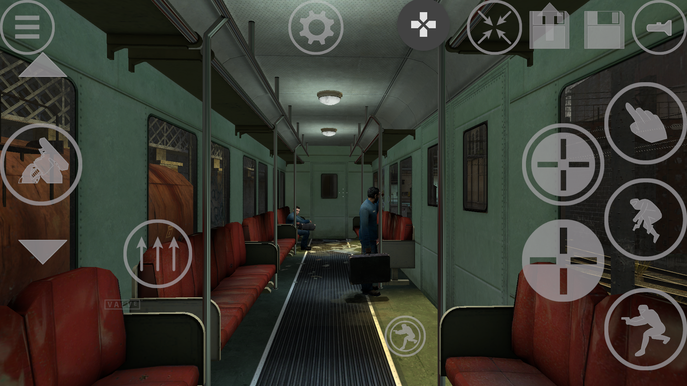
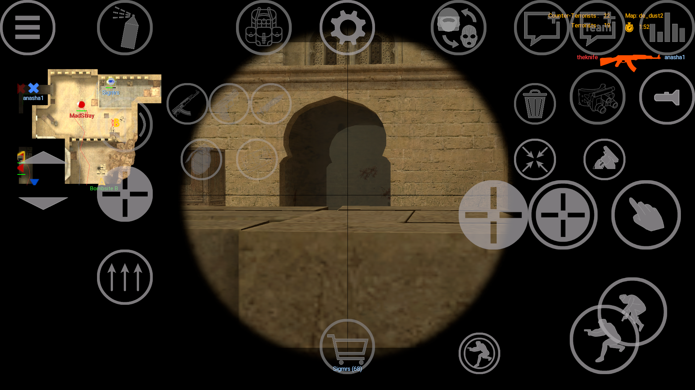

!!!danger Work In Progress

This wiki is still unfinished and work in progress

!!!

## :sparkles: Introduce

Source Engine on Android is a project by nillerusr based on Source Engine 2018 of PC version. It lets you play ported Source Engine games developed by Valve on Android device

In this wiki we will describe you everything, you wanted to know about this project and how to start playing on your mobile device :icon-device-mobile:

!!!contrast

The project is still in development. Please be patient with bugs and just wait for future features and updates

!!!

### Screenshots

---

## :icon-download: Quick start

1. Install Half-Life 2 game on PC. You can get it on official [Steam store platform](https://store.steampowered.com/app/220/HalfLife_2/)
2. Create `srceng` folder in your internal storage (`/storage/emulated/0/srceng`) on mobile device
3. Copy platform and hl2 folders from Half-Life 2 on PC folder to your mobile device to `/storage/emulated/0/srceng` folder
4. Install Source Engine apk on your mobile device from the link below
5. Launch Half-Life 2 in the installed Source Engine app

[!file source-engine-v1.11.apk](https://drive.google.com/file/d/13TLJoZ4aoNeUAAsQRI_9NN5zCwzdXsNJ/view?usp=sharingchangelog)

[!ref Read more in client installation](source-engine/installation)

---

## Supported games by this port

#### Half-Life: Source

Half-Life: Source is a direct port of the original Half-Life game to Half-Life 2’s Source engine, introducing graphics and AI improvements as well as some subtle level changes.

#### Half-Life 2

Half-Life 2 is a linear first-person shooter with light puzzle-solving elements and many setpieces, similar to its predecessor in concept. The player guides Gordon Freeman through the City 17 and the wilderness that surrounds it. On his way, he'll encounter a few friendly characters, but also fight dangerous foes.

#### Half-Life 2: Episode 1 and 2

Continuation of the linear first-person shooter Half-Life 2.

#### Half-Life 2: Deathmatch

Half-Life 2: Deathmatch is a multiplayer first-person shooter video game developed by Valve Corporation.

#### Day of Defeat: Source

Day of Defeat: Source is a team-based online first-person shooter multiplayer video game developed by Valve Corporation. Set in World War II, the game is a remake of Day of Defeat.

#### Counter-Strike: Source

The remake of Counter-Strike (2000) using the Source game engine developed by Valve Corporation.

#### And some other community mods

You can discover some mods, ported by our community in our [Discord](#support) guild

[!ref Proceed to installation guide](source-engine/installation)

---

## :gift: Donation

You can support this project by a donation for the author

#### Primary donate

https://new.donatepay.ru/en/@nillerusr

#### Cryptocurrency
Currency | Wallet
--- | ---
BTC | bc1qnjq92jj9uqjtafcx2zvnwd48q89hgtd6w8a6na
XMR | 48iXvX61MU24m5VGc77rXQYKmoww3dZh6hn7mEwDaLVTfGhyBKq2teoPpeBq6xvqj4itsGh6EzNTzBty6ZDDevApCFNpsJg

---

## Support

Our general support you can reach in our Discord community guild

!!!warning Read FAQ

Please, read FAQ before asking the questions. Maybe it already has the solution or answer for your issue! Otherwise you could be punished

!!!

[!embed width="350" height="500"](https://canary.discord.com/widget?id=672055862608658432&theme=dark")
