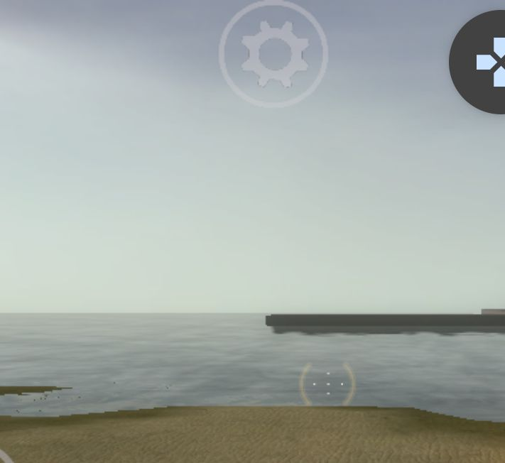
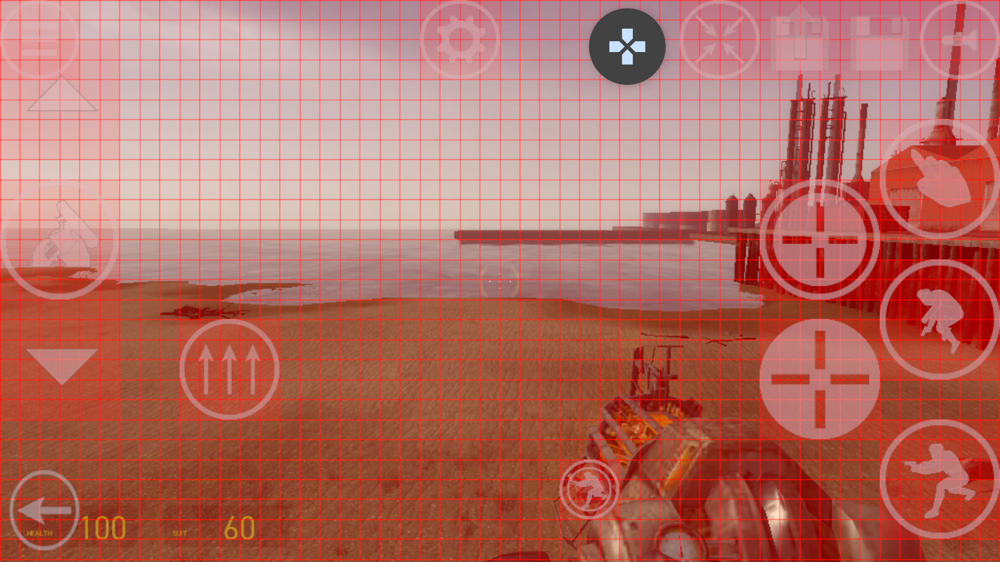
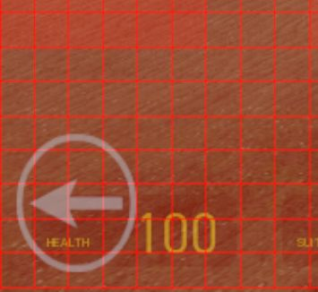
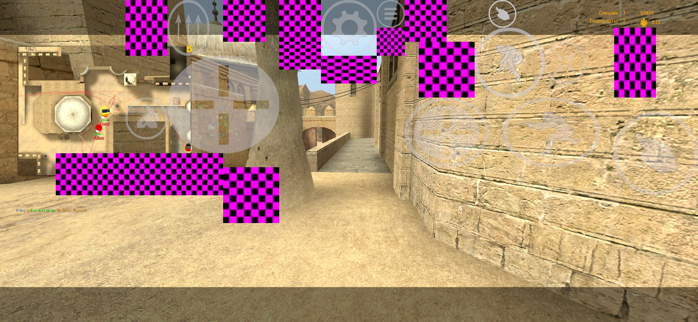
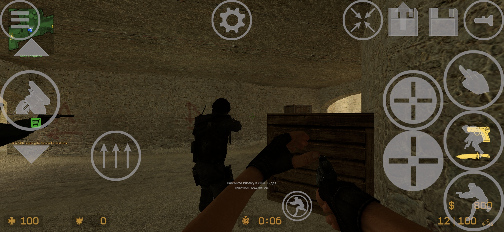
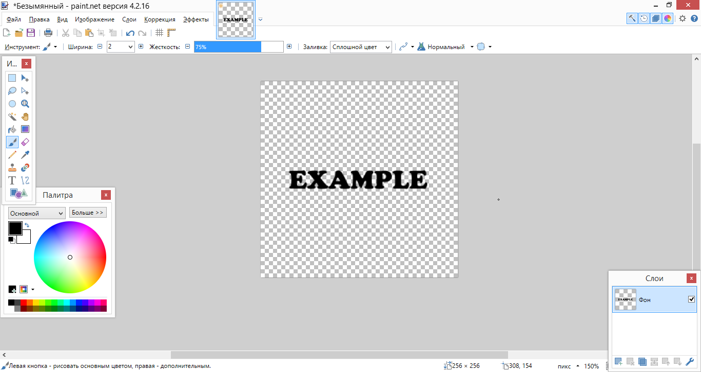
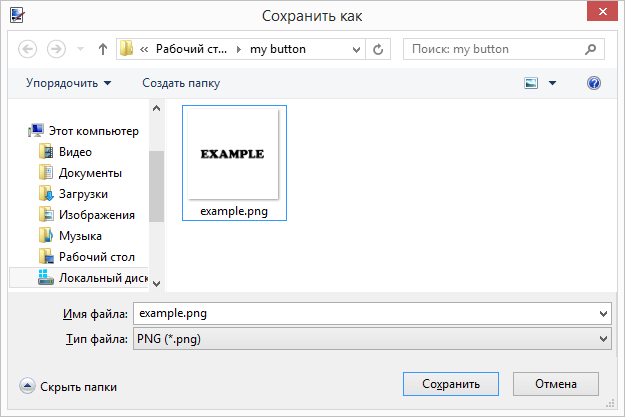
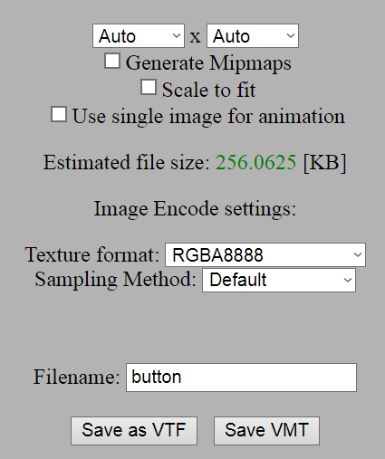
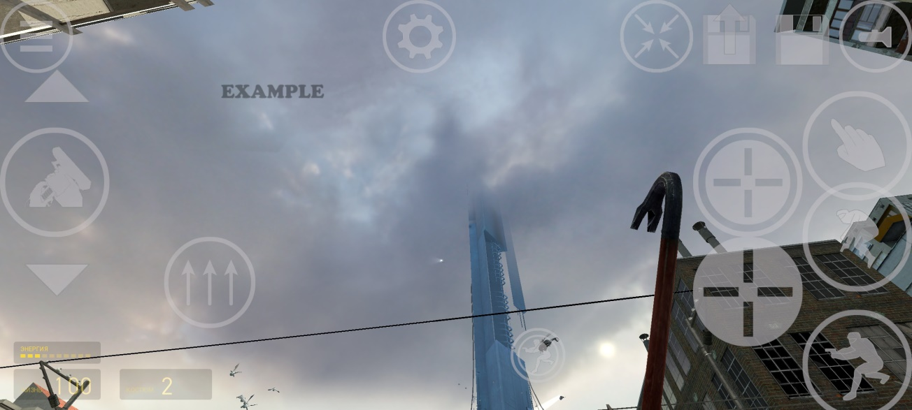

## Edit touch layout

### Edit buttons positions and size

In all games on your touch layout there are should be a settings button included at the top of the screen



When you click it, all buttons become red colored and red grid appears.



Editing:

- With single finger you can move the single button.
- With two fingers you can resize the single button by the second finger touched and move by the first finger touched.

When you finish touch layout editing you can click on the button in down left corner of the screen to exit editing mode.



!!!

For saving changes you should exit from the game using Quit button in the game main menu.

!!!

### Add, edit and remove buttons

TODO

---

## Installation of missing buttons in CS:S

You can get this issue at some moment and have missing buttons in Counter-Strike: Source





You can fix this by installing touch buttons manually

[!file](https://cdn.discordapp.com/attachments/775750585387450379/954063398444888124/touch_buttons_css3.zip)

1. Download this zip archive
2. Copy the `cstrike` folder from archive to the `/storage/emulated/0/srceng` folder
3. Now the issue should be fixed and you will have default touch layout installed

---

## How to create custom button

In some cases players wanted to have own custom buttons for themselves or make their own packs.

Here is the steps, how to create custom button

#### 1. Create a button texture.

##### 1.1. Draw button

It's important part, if you planning to use texture not from default texture list. You can use any image editor you want. Adobe Illustrator, Paint.NET, GIMP or any other.



##### 1.2. Export image

You should export the result image for texture in VTF image file format. If your image editor doesn't support this image format, you can export it to PNG or TGA



###### 1.2.1. Convert PNG or TGA to VTF

Convert your image to VTF image format in case you exported it in PNG or TGA format. There are many methods to do that. But here is most recommended: [VTFEdit](https://github.com/NeilJed/VTFLib/releases/) and [Online converter](https://rafradek.github.io/Mishcatt/).

We will use Online converter for example.



Here you need to select RGBA8888 Texture format and specify filename for your button texture. Then click `Save as VTF`

##### 1.3. Create VMT file

VMT ("Valve Material Type") is a text file that defines a two-dimensional surface. It contains all of the information needed for Source to simulate the surface visually, aurally, and physically. Source engine requires it for any texture

For the `button.vtf` texture, we create a `button.vmt` file, which should contain the following text:

```
"UnlitGeneric"
{
	"$basetexture"	"vgui/touch/button"
	"$translucent" "1"
	"$ignorez" "1"
	"$vertexcolor" "1"
	"$vertexalpha" "1"
}
```

In the `$basetexture` you should specify the filename of your button as in example

##### 1.4. Put texture

Put the `button.vtf` and `button.vmt` files to the `/storage/emulated/0/srceng/<game>/materials/vgui/touch/` directory. `<game>` should be the game folder, where you want to add this button texture

#### 2. Create the button

Open `/storage/emulated/0/srceng/<game>/cfg/touch.cfg`. Add the following command at the end.

```

touch_addbutton "button" "vgui/touch/button" "gameui_activate" 0.200000 0.000000 0.080000 0.177778 255 255 255 155 0 1.000000

```

Where `button` is the name of the button, `vgui/touch/button` is the path to the `.vmt` file, `gameui_activate` is the command that the button activates when clicked.

